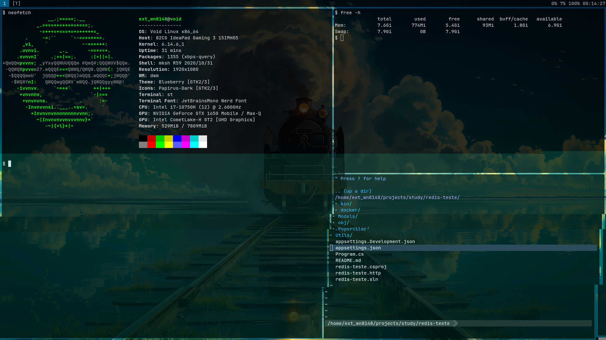

# st - Customized Simple Terminal

A personal fork of [suckless st](https://st.suckless.org/) (simple terminal), featuring a curated set of patches and customizations aimed at enhancing usability, performance, and visual appeal while preserving the minimalist philosophy of the original project.

## Features

- 🖋 **Custom Appearance**: Tweaked colorscheme, fonts, and transparency support for a cleaner, more modern look.
- 🔧 **Usability Enhancements**:
  - Scrollback with keyboard and mouse
  - Copy/paste integration with the system clipboard
  - URL detection and launching
- ⚡ **Performance Optimizations**: Lightweight and fast, following the Suckless philosophy.
- 🧩 **Pre-applied Patches**:
  - [alpha](https://st.suckless.org/patches/alpha)

## Screenshots




## Installation

### Requirements

- `libX11`
- `libXft`
- `libXrender`
- `fontconfig`
- `make` and a C compiler

### Build & Install

```bash
git clone https://github.com/wellingtonctm/st.git
cd st
sudo make clean install
```

> **Note**: You may want to backup your current st configuration or uninstall it first if it’s already installed system-wide.

## Configuration

All configuration is done by editing the `config.h` file before compiling. This is in line with the Suckless philosophy: no runtime configuration, everything is in the source.

To apply changes:

```bash
make clean
make
sudo make install
```

## Fonts & Appearance

This build uses a custom font setup. You can change fonts by editing the `config.h`:

```c
static char *font = "JetBrainsMono Nerd Font:size=12";
```

> Make sure the font you set is installed on your system.

## License

This project is released under the MIT/X Consortium license, the same as the original [st](https://st.suckless.org/) project. See the `LICENSE` file for more details.

## Credits

- [Suckless.org](https://suckless.org) for the original `st`
- Various contributors of patches used in this build
